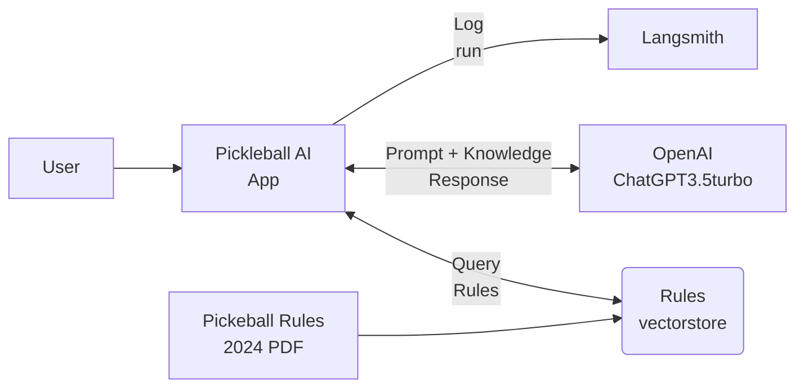

# Pickleball AI App
AI bot to help parse the rules of Pickleball.

## Project Goals

1. Create a retrieval augmented generation (RAG) bot that can answer questions about pickleball
2. Use the official rules of pickleball as a source to answer the questions

## Implementation

Planned implementation using standard RAG methodology. Documents are loaded to a vector database. A chain is executed to find documents similar to the input question, use that as additional context, and answer the question.

### Project Setup

* Clone the project from the git repository.

* Create a virtual environment using pip.

```bash
pip install requirements.txt
```

* Run `download_documents.ps1` to download the required data.

```bash
. '.\download_documents.ps1'
```

#### Download and install Microsoft C++ Build Tools

If you have an issue installing the requirements, specifically failing to build wheels for chorma-hnswlib, download and install Microsoft C++ Build Tools: https://visualstudio.microsoft.com/visual-cpp-build-tools/

Try installing way more than you think you need. If clicking the **Launch** button in the Visual Studio Installer displays **File not found** or similar in the command prompt window, you probably didn't install all of the components. I had success with MSVC v143 - VS 2022 C++ x64/x86 build tools (latest), Windows 11 SDK (10.0.22621.0), C++ CMake tools for Windows, Testing tools core features - Build Tools, C++ AddressSanitizer, C++ Build Tools core features, C++ 2022 Redistributable Update, and C++ core desktop features installed.

*This step never works right for me, I end up installing and uninstalling things for hours.*

#### Create a .env file

The .env file should have the following variables defined.

```
OPENAI_API_KEY=XXXXXXXXXXXXXXX
LANGCHAIN_API_KEY=XXXXXXXXXXXXXXXXXXXX
LANGCHAIN_TRACING_V2=true
```

### Vector Database

The vector database used is Chromadb. It is quick to setup and easy to use in LangChain

The vectors are created using OpenAI's `Text-embedding-ada-002-v2` model.

The documents are loaded using `PyPDFLoader`, because this provides the PDF page number. Some work is still left to split the documents by each rule. The input PDF has a really good structure that would lend itself to splitting down into further chunks. This has the potential to save on tokens and provide more concise, accurate results.

For search, the method is *similarity* and the number of documents to retrieve is *3*. The number of documents might need to be changed if the chunking methodology is changed.

### FastAPI

The code is accessed using FastAPI. There is a route `/pickleball-query` created to accept user input questions and return a response JSON object with the AI reponse.

The API is documented and swagger UI can be accessed at the `/docs` route.

There was an annoying error while testing the API from the browser where the browser automatically request a favicon. It makes a request to the `/favicon` route that was failing. To fix this, I found a pickleball icon and created a `/favicon` path. This prevents the error when testing the API in the browser and makes it easier to find the correct tab.

### Langsmith

To track AI traces, Langsmith is used. LangChain has an built in integration, so all parts of chains are logged to Langsmith and can be viewed in the project. This allows the AI to be monitored at each stage of each query, including performance timing.

## The Architecture



# Credits

Favicon used in the REST API is from https://www.flaticon.com/free-icons/game-ball, Game-ball icons created by Eklip Studio - Flaticon. Not like an API really needs a favicon, but the browser requests it and it makes it easier to find the browser tab when I'm debugging.